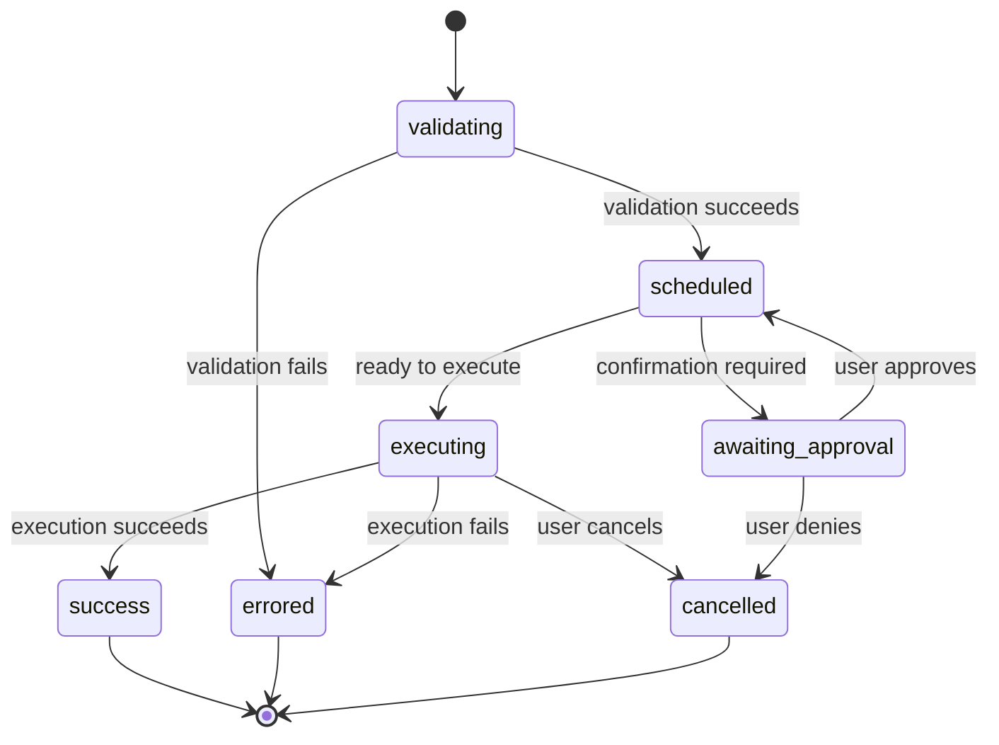

# Internal Todo List Specification

This document describes the internal "todo list" that the agent uses to manage its tasks. This is a conceptual model that is to be implemented in the new todo.go and fully tested by todo_test.go.

## Overview

The agent's internal todo list is a sophisticated task management system that is responsible for:

*   **Receiving and validating tasks:** The agent can be given tasks in the form of "tool calls". These tasks are first validated to ensure that they are well-formed and that the requested tool exists.
*   **Managing the task lifecycle:** Each task goes through a series of states, from "validating" to "scheduled" to "executing" and finally to a terminal state of "success", "error", or "cancelled".
*   **Executing tasks:** The agent executes tasks by calling the appropriate tool with the specified arguments.
*   **Handling task completion:** When a task is complete, the agent is notified so that it can process the results.
*   **Queueing user messages:** The agent can also queue user messages that arrive while it is busy, and then process them later.
*   **Requesting user confirmation:** The agent can be configured to ask the user for confirmation before executing a task.

## Core Components

The internal todo list is implemented by the following core components:

*   **`CoreToolScheduler`**: This class is the heart of the todo list. It manages a queue of "tool calls" and orchestrates their execution.
*   **`ToolCall`**: This is a data structure that represents a single task. It contains information about the tool to be called, the arguments to be passed to the tool, and the current status of the task.
*   **`useMessageQueue`**: This is a React hook that implements a simple queue for user messages.

## Data Structures

### ToolCall

A `ToolCall` is a union type that can be in one of the following states:

*   **`ValidatingToolCall`**: Represents a tool call that is being validated.
*   **`ScheduledToolCall`**: Represents a tool call that is scheduled for execution.
*   **`ExecutingToolCall`**: Represents a tool call that is currently executing.
*   **`WaitingToolCall`**: Represents a tool call that is waiting for user approval.
*   **`SuccessfulToolCall`**: Represents a tool call that has completed successfully.
*   **`ErroredToolCall`**: Represents a tool call that has failed.
*   **`CancelledToolCall`**: Represents a tool call that has been cancelled.

Each of these types has a `status` field that indicates its state, as well as other fields that are specific to that state.

## Task Lifecycle

A task goes through the following states:



1.  **`validating`**: The task is being validated to ensure that it is well-formed.
2.  **`scheduled`**: The task has been validated and is waiting to be executed.
3.  **`awaiting_approval`**: The agent is waiting for the user to confirm that the task should be executed.
4.  **`executing`**: The task is currently being executed.
5.  **`success`**: The task has been executed successfully.
6.  **`error`**: An error occurred while executing the task.
7.  **`cancelled`**: The task was cancelled by the user.

## CoreToolScheduler

The `CoreToolScheduler` is the main component that manages the "todo list". It has the following key methods:

*   **`schedule(request, signal)`**: This method is used to add a new tool call to the todo list. It takes a `ToolCallRequestInfo` object and an `AbortSignal` as input. The `ToolCallRequestInfo` object contains information about the tool to be called and the arguments to be passed to it. The `AbortSignal` can be used to cancel the tool call.
*   **`handleConfirmationResponse(callId, originalOnConfirm, outcome, signal, payload)`**: This method is used to handle the user's response to a confirmation request. It takes the `callId` of the tool call, the original `onConfirm` callback, the `outcome` of the confirmation, an `AbortSignal`, and an optional `payload` as input.
*   **`attemptExecutionOfScheduledCalls(signal)`**: This method is used to execute all the tool calls that are in the `scheduled` state. It takes an `AbortSignal` as input.
*   **`checkAndNotifyCompletion()`**: This method is used to check if all the tool calls are complete and then notify the caller.

The `CoreToolScheduler` uses a state machine to manage the lifecycle of each tool call. The `setStatusInternal` method is used to transition a tool call between the different states.

## API

The internal todo list is not exposed as a public API. However, it is used by the following components:

*   **Slash commands**: Slash commands can return a `ToolActionReturn` object, which represents a request to schedule a tool call.
*   **The main application loop**: The main application loop uses the `useMessageQueue` hook to queue user messages.

## SlashCommand

The `SlashCommand` interface is used to define a command that the user can invoke. It has the following key properties:

*   **`name`**: The name of the command.
*   **`description`**: A description of the command.
*   **`action`**: A function that is called when the command is invoked. This function can return a `SlashCommandActionReturn` object, which represents a request to perform an action.
*   **`subCommands`**: An array of sub-commands.

The `SlashCommandActionReturn` is a union type that can be one of the following:

*   **`ToolActionReturn`**: Schedule a tool call.
*   **`MessageActionReturn`**: Display a message to the user.
*   **`QuitActionReturn`**: Quit the application.
*   **`OpenDialogActionReturn`**: Open a dialog box.
*   **`LoadHistoryActionReturn`**: Load a new set of history items.
*   **`SubmitPromptActionReturn`**: Submit a prompt to the Gemini model.
*   **`ConfirmShellCommandsActionReturn`**: Ask the user to confirm a shell command.
*   **`ConfirmActionReturn`**: Ask the user for a generic confirmation.

## Future Work

The internal todo list could be extended in the following ways:

*   **Dependencies**: The todo list could be extended to support task dependencies, so that a task is not executed until its dependencies have been completed.
*   **Concurrency**: The todo list could be extended to support concurrent task execution.
*   **Prioritization**: The todo list could be extended to support task prioritization.

## Integration

This section details the required changes to integrate the `CoreToolScheduler` into the existing codebase.

### 1. TUIModel

The `TUIModel` in `main.go` will be updated to include the `CoreToolScheduler` and a message queue.

```go
// TUIModel represents the bubbletea model for the TUI
type TUIModel struct {
	// ... existing fields
	scheduler     *CoreToolScheduler
	userMessageQueue []string
}
```

The `NewTUIModel` function will be updated to initialize the `CoreToolScheduler`.

### 2. Tool Wrapper

The `toolWrapper` in `main.go` will be updated to schedule tool calls with the `CoreToolScheduler` instead of executing them directly.

```go
func (tw *toolWrapper) Call(ctx context.Context, input string) (string, error) {
	// Instead of calling the tool directly, schedule it with the scheduler.
	// The scheduler will then be responsible for executing the tool call.
	// The TUI will be notified of the state changes of the tool call.
	// For now, we will just call the tool directly.
	// TODO: Implement the CoreToolScheduler and integrate it here.
	if tw.handler != nil {
		tw.handler.HandleToolStart(ctx, input)
	}

	output, err := tw.t.Call(ctx, input)
	if err != nil {
		if tw.handler != nil {
			tw.handler.HandleToolError(ctx, err)
		}
		return "", err
	}

	if tw.handler != nil {
		tw.handler.HandleToolEnd(ctx, output)
	}

	return output, nil
}
```

The `TODO` comment will be replaced with the actual implementation of the scheduling logic.

### 3. TUI Update Method

The `Update` method of the `TUIModel` in `main.go` will be updated to handle messages from the `CoreToolScheduler`.

```go
// Update implements bubbletea.Model
func (m TUIModel) Update(msg tea.Msg) (tea.Model, tea.Cmd) {
	// ... existing code

	switch msg := msg.(type) {
	// ... existing cases

	// Add new cases to handle messages from the CoreToolScheduler
	case ToolCallScheduledMsg:
		// Handle tool call scheduled event
	case ToolCallExecutingMsg:
		// Handle tool call executing event
	case ToolCallWaitingForApprovalMsg:
		// Show confirmation dialog
	case ToolCallSuccessMsg:
		// Handle tool call success event
	case ToolCallErrorMsg:
		// Handle tool call error event
	}

	// ... existing code
}
```

### 4. User Message Queue

The `TUIModel` will have a `userMessageQueue` to store user messages that arrive while the agent is busy. The `Update` method will be updated to add messages to the queue when the agent is busy.

When the `CoreToolScheduler` notifies the TUI that all tool calls are complete, the TUI will process the messages from the queue.

### 5. New Files

The `CoreToolScheduler` and related data structures will be implemented in a new file `todo.go`. Tests will be added in `todo_test.go`.
